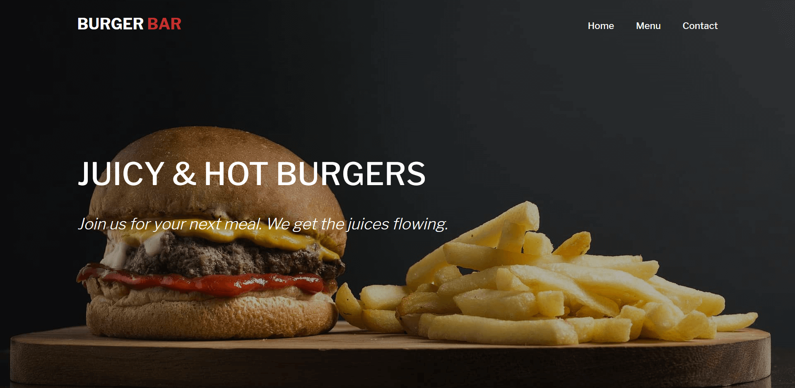

# Restaurant homepage
> Restaurant homepage created using HTML, CSS and JavaScript.

## Table of contents
* [General info](#general-info)
* [Screenshots](#screenshots)
* [Technologies](#technologies)
* [Setup](#setup)
* [Status](#status)
* [Inspiration](#inspiration)
* [Contact](#contact)

## General info
Restaurant home page created using JavaScript. All content is added and removed dynamically. 

## Screenshots


## Technologies
* HTML
* CSS (Flexbox, Grid)
* JavaScript (ES6 Modules)

## Setup
You can visit the live version of this website [here](https://thisismahmad.github.io/restaurant-homepage/).

OR

You can clone this repository by executing following command in your terminal. 
```bash
git clone git@github.com:thisisMAhmad/restaurnat-homepage.git
```
Then cd into 'restaurant-homepage' directory from your terminal. 

To open the webpage in browser execute following command w.r.t. your OS after opening 'dist' folder.

### Windows
```bash
start index.html
```

### Linux
```bash
xdg-open index.html
```

### Mac 
```bash
open index.html
```

### Install project dependencies
To install the project dependencies, go to root directory of project and execute the following command in your terminal.

```bash
npm install
```

## Status
Project is: _finished_

## Inspiration
Project has been completed while following The Odin Project's [curriculum](https://www.theodinproject.com/courses/javascript/lessons/restaurant-page)

## Contact
Created by [@Muhammad Ahmad](https://www.twitter.com/thisisMAhmad) - feel free to contact me!
